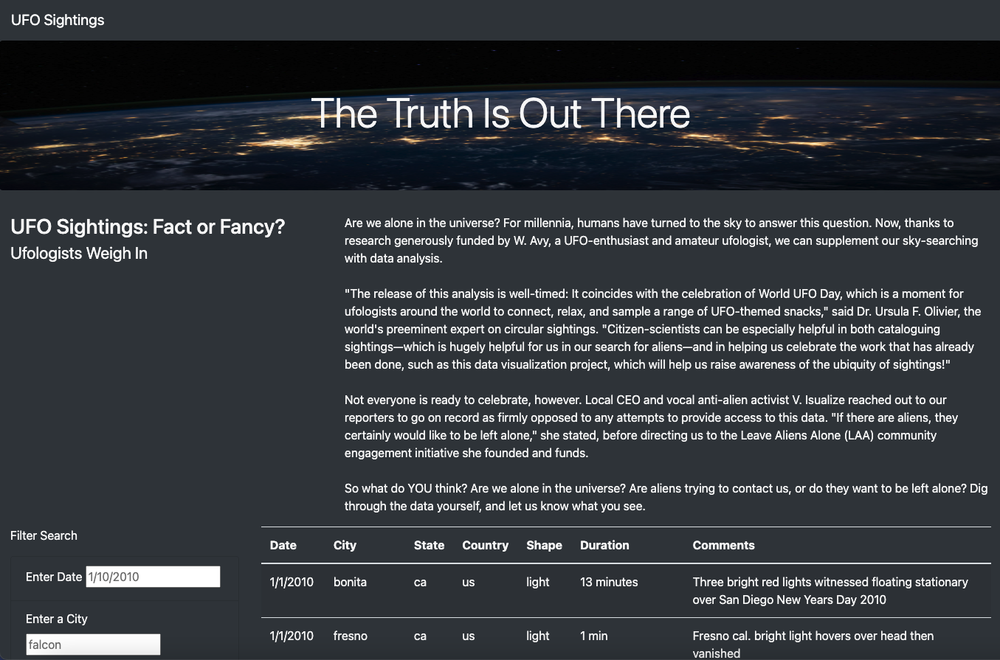
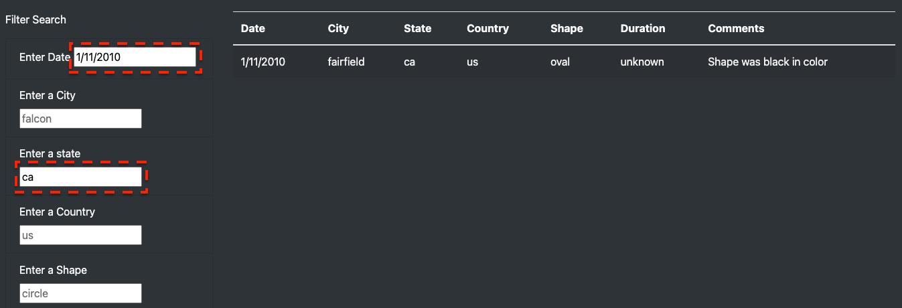
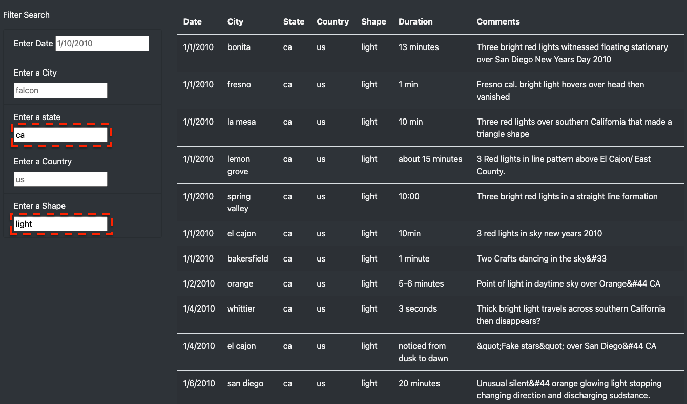

# UFOs
## Overview of the analysis
The purpose of the project is to build a dynamic webpage tthat accepts user inputs and adjusts accordingly to display information about UFOs sightings. 

## Results
The webpage [UFO sightings](https://sharof17.github.io/UFOs/index.html) was created. The index page of the webpage looks as follows:

At the bottom of webpage there is Filter Search, on the left. The following screenshots illustrate the how the filter can be used:

## Summary

### Drawbacks of the webpage:
- The search field is "case-sensitive". It means that the outcome table will not update if the entry does not have exact match. 

### Recommendations:
- Entry fields would be more efficient if they were dropdown lists. As it would eliminate the "case-sensitivity" problem.
- It would be better to work on custimization of the webpage. e.g. "Click" button, "Clear the filter" button.
- Adding functionality to pull the "fresh" data from live source.
